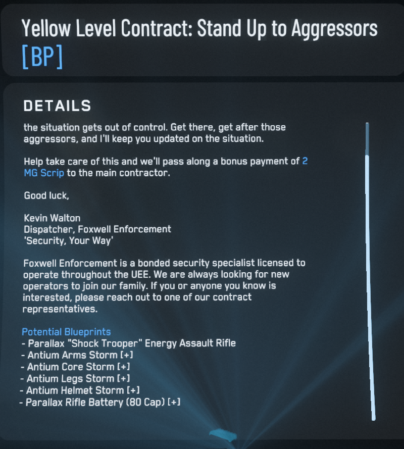
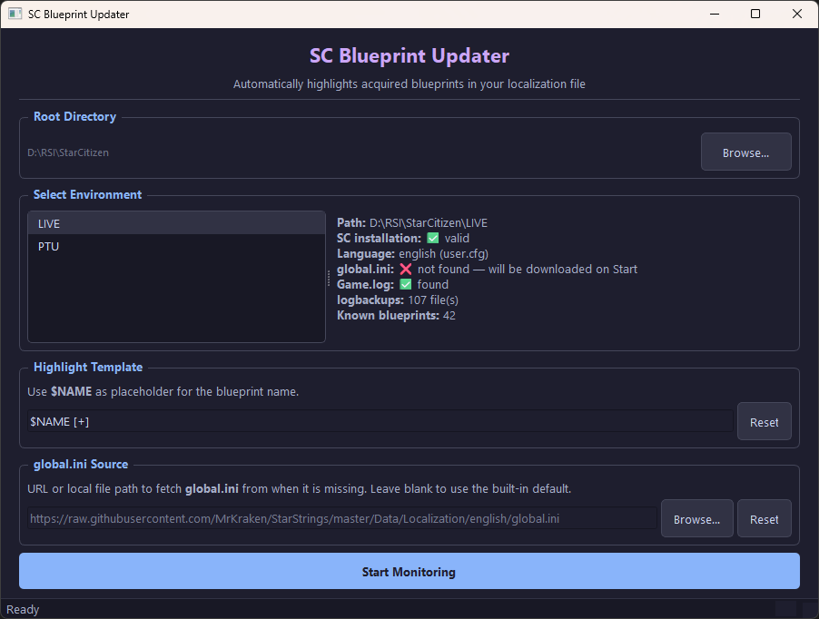
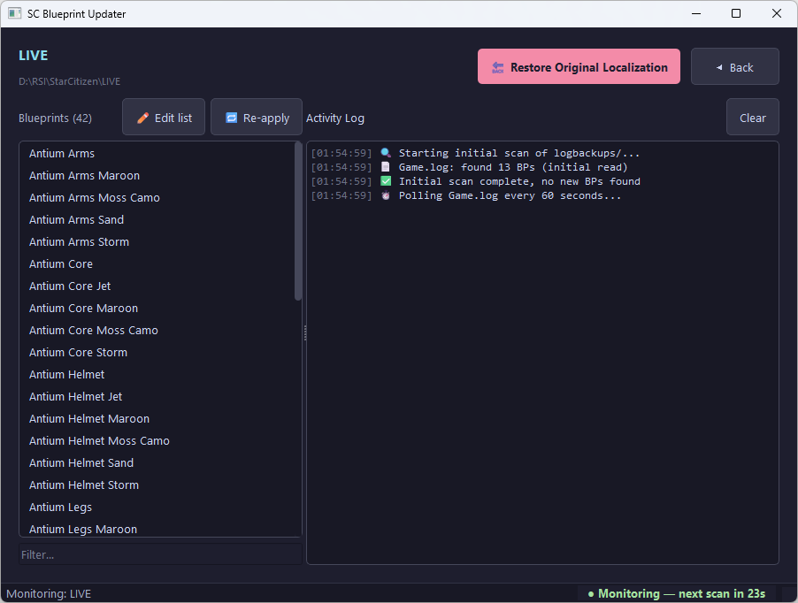

# SC Blueprint Updater

Утилита для Star Citizen, которая отслеживает полученные чертежи (blueprints)
и автоматически помечает их в файле локализации — чтобы в игре
сразу было видно, какие BP у вас уже есть.

---

## Зачем это нужно

В Star Citizen список чертежей нигде наглядно не отображается, кроме как в фабрикаторе.
Когда чертежей накапливается несколько десятков, становится сложно вспомнить,
уже есть такой чертеж или нет.

Приложение решает эту задачу без модификации игровых файлов — оно меняет только
файл **локализации** (`global.ini`), добавляя к названию каждого найденного BP
настраиваемую метку. Например:

```
Gemini S71 Rifle                →   Gemini S71 Rifle [+]
Hurston Dynamics Devastator     →   Hurston Dynamics Devastator [+]
```

Метку `[+]` вы увидите прямо в интерфейсе игры рядом с названием предмета —
в описании миссии, в окне крафта.

---

## Требования

**Вариант A — готовый exe (рекомендуется):**
Просто запустите `SC Blueprint Updater.exe`. Ничего устанавливать не нужно.

**Вариант B — из исходников:**
- Python 3.12+ с [python.org](https://www.python.org/downloads/)
  (**не** из Microsoft Store — см. [почему](#важно-про-microsoft-store-python))
- PySide6:
  ```
  pip install PySide6
  ```
- Запуск:
  ```
  python sc_blueprint_updater.py
  ```

---

## Первый запуск

### 1. Выберите корневой каталог

Нажмите **Browse…** и укажите папку, в которой находятся окружения игры.
Обычно это:
```
C:\Program Files\Roberts Space Industries\StarCitizen\
```

После выбора в списке появятся все найденные окружения (LIVE, PTU и т.д.).



### 2. Выберите окружение

Кликните на нужное окружение. В панели справа отобразится информация:
обнаруженный язык, статус `global.ini`, наличие лог-файлов и количество
уже известных BP.

Окружения без необходимых маркеров (`Bin64\` и `Data.p4k`) будут показаны
серым — такие папки, скорее всего, выбраны ошибочно.

### 3. Настройте шаблон метки (опционально)

По умолчанию используется шаблон `$NAME [+]`. Вы можете изменить его в поле
**Highlight Template** — `$NAME` будет заменено на название BP. Примеры:
- `$NAME [✓]` — если в вашей локализации есть соответствующие символы в шрифтах
- `<EM4>$NAME</EM4>` — если ваша локализация поддерживает теги форматирования

### 4. Нажмите Start Monitoring



Если файл `global.ini` ещё не существует — приложение предложит скачать его.
Источник указывается в поле **global.ini Source**; по умолчанию используется
актуальная локализация от MrKraken (https://github.com/ExoAE/ScCompLangPack).

При первом запуске автоматически:
- Создаётся резервная копия `global.ini.original`
- Сканируются все архивные лог-файлы из папки `logbackups/`
- В `global.ini` добавляются метки для всех найденных BP

---

## Как это работает во время игры

После запуска мониторинга приложение каждые **60 секунд** читает `Game.log`
и ищет новые полученные чертежи. Как только они найдены — список BP обновляется
и метки в `global.ini` добавляются автоматически. В правом нижнем углу окна
отображается обратный отсчёт до следующего сканирования.

> **Совет:** перезапуск игры не является проблемой. Приложение отслеживает
> размер `Game.log` и при пересоздании файла автоматически начинает чтение
> с начала.

---

## Сканирование истории: все BP за всё время

При первом запуске для каждого окружения приложение **просканирует все архивные
лог-файлы** из папки `logbackups/`. Star Citizen автоматически сохраняет туда
логи предыдущих сессий — это позволяет найти все BP, которые вы когда-либо
получали, даже если играли задолго до установки SC Blueprint Updater.

Уже просканированные файлы запоминаются (по размеру и дате изменения) и повторно
не читаются, поэтому повторный запуск происходит быстро.

---

## Редактирование списка BP вручную

Иногда нужно добавить BP, которого нет в логах, или убрать ошибочно найденный.
Нажмите кнопку **✏️ Edit list** — откроется файл `blueprints.txt` в системном
текстовом редакторе. Каждое имя BP — на отдельной строке.

После сохранения файла приложение **автоматически** перечитает список и обновит
метки в `global.ini`. Вручную нажимать ничего не нужно.

Если нужно принудительно переприменить список (например, после смены шаблона) —
нажмите кнопку **🔁 Re-apply**.

---

## Если что-то пошло не так: восстановление оригинала

При первом запуске мониторинга для каждого окружения автоматически создаётся
резервная копия `global.ini.original`. Это происходит **до любых изменений**.

Чтобы полностью откатиться — нажмите кнопку **🔙 Restore Original Localization**.
После подтверждения `global.ini` будет заменён оригинальной копией, все метки
исчезнут. Резервная копия при этом не удаляется: процедуру можно повторить
в любой момент.

---

## Обновление версии игры

При обновлении Star Citizen файл `global.ini` заменяется новой версией.
Это означает:

1. Все добавленные метки **исчезнут** вместе со старым файлом.
2. Нужно скачать новую версию `global.ini` и снова применить BP-метки.

**Как обновить:**

1. Запустите SC Blueprint Updater.
2. Выберите окружение — приложение увидит, что `global.ini` отсутствует,
   и предложит скачать его заново.
3. После скачивания нажмите **Start Monitoring** — метки будут переприменены
   автоматически.

> Если вы уже скопировали новый `global.ini` вручную — просто нажмите
> **🔁 Re-apply** в окне мониторинга.

---

## Использование собственного файла локализации

Вы можете использовать любой файл локализации — например, фанатский перевод.
Два способа:

**Вариант A — локальный файл:**
В поле **global.ini Source** нажмите **Browse…** и выберите нужный `.ini`-файл
на диске. При необходимости скачивания он будет скопирован вместо загрузки из сети.

**Вариант B — свой URL:**
Вставьте в поле **global.ini Source** прямую ссылку на файл.

Если поле оставить пустым — используется дефолтный источник: актуальная
англоязычная локализация от сообщества
([MrKraken/StarStrings](https://github.com/MrKraken/StarStrings)).

---

## Несколько языков

Приложение автоматически определяет язык вашего клиента, читая файл `user.cfg`
в корне окружения (параметр `g_language`). Если файл отсутствует — используется
`english`. Путь к `global.ini` строится с учётом языка:
```
data\Localization\<язык>\global.ini
```
Никакой ручной настройки не требуется.

---

## Несколько окружений (LIVE, PTU, EPTU)

SC Blueprint Updater поддерживает все окружения одновременно. Для каждого
хранится свой список BP и свои настройки — история покупок в PTU не смешивается
с LIVE. Переключение между окружениями — на стартовом экране.

---

## Фильтрация списка BP

В окне мониторинга под списком чертежей есть поле фильтра. Введите часть
названия — список сузится до совпадений. Поддерживается glob-синтаксис:
`*` заменяет любую последовательность символов.

Примеры:
- `gemini` — все BP с «gemini» в названии
- `hurston*rifle` — BP, содержащие «hurston», а затем «rifle»

Счётчик в заголовке показывает `Blueprints (6/17)` — сколько видно из общего
числа.

---

## Где хранятся данные

Все настройки и списки BP хранятся в папке:
```
Документы\SCBlueprintUpdater\
```

Там вы найдёте `blueprints.txt` для каждого окружения — его можно редактировать
вручную в любом текстовом редакторе, переносить между компьютерами или делать
резервные копии.

---

## Важно про Microsoft Store Python

Если вы запускаете приложение из исходников, используйте Python
**с официального сайта python.org**. Python из Microsoft Store перехватывает
обращения к папке `AppData` на уровне ядра Windows, что приводит к сохранению
файлов настроек в изолированный sandbox вместо реальной папки пользователя.
Кроме того, он нестабилен при интенсивных файловых операциях.

---

## Лицензия

Проект распространяется свободно. Используйте на свой страх и риск —
приложение не является официальным инструментом Cloud Imperium Games.
